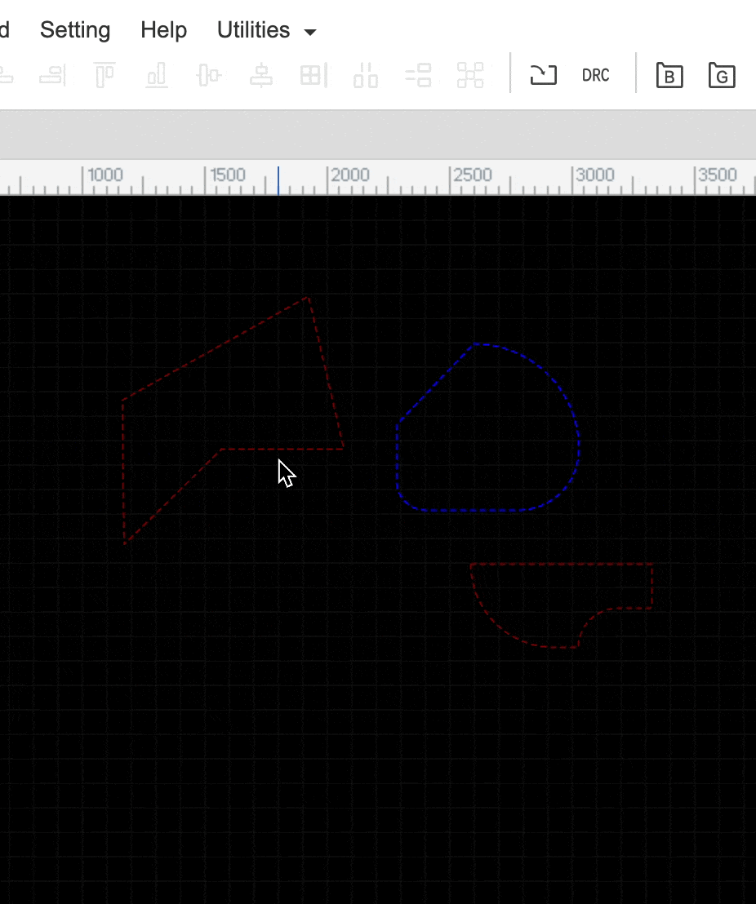
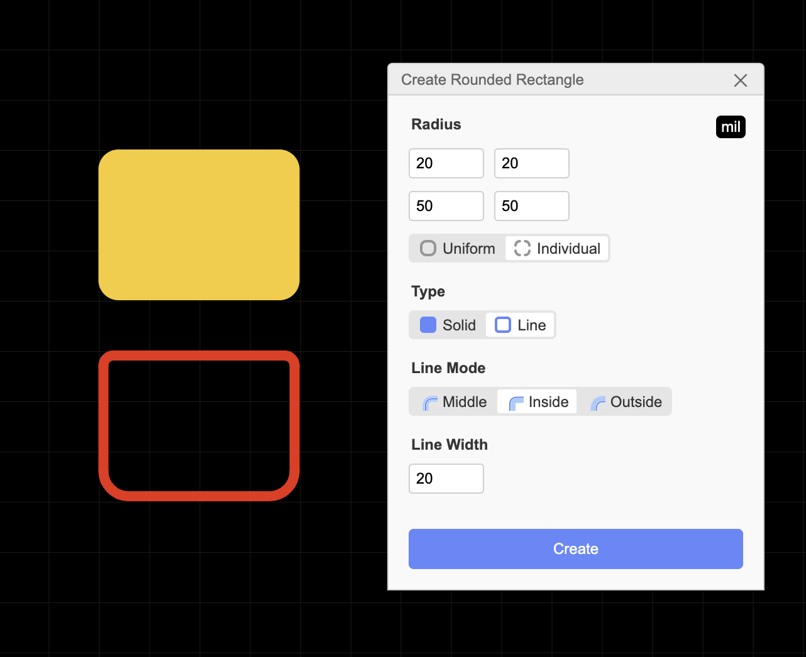
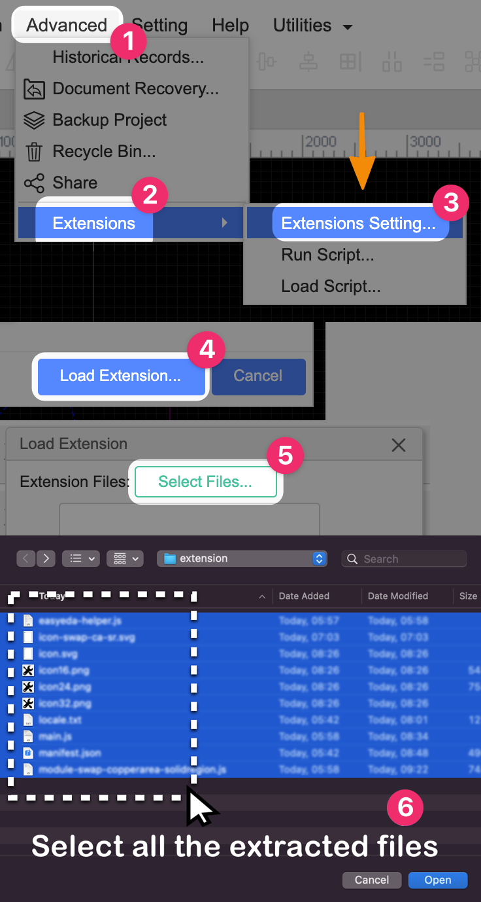

# EasyEDA Utilities

A collection of EasyEDA utilities I've developed to enhance my workflow.

> [!NOTE]
> No warranties and unlicensed, use at your own risk.
Report any issues you encounter, PR is welcome.

## List of Functions:

#### 1. Swap Between Copper Area & Solid Region
`Alt` `C`

Easily toggle between Copper Area and Solid Region with just one click. This utility simplifies the process of switching between these two modes, making your design process more efficient.

#### 2. Create Rounded Rectangle from Rectangle
`Alt` `R`

Convert standard rectangles into rounded rectangles effortlessly. This feature is particularly useful for creating custom pads or custom shapes to improve the aesthetics of your designs.

---
More features coming soon...

## Download
> [Click here to download the latest release](https://github.com/RayPS/easyeda-utilities/releases/download/latest/extension.zip)

## Installation

1. Download the zip file from the link above.
2. Extract the contents of the zip file.
3. Follow the steps below for installation:

  
Expand Installation Guide

  

